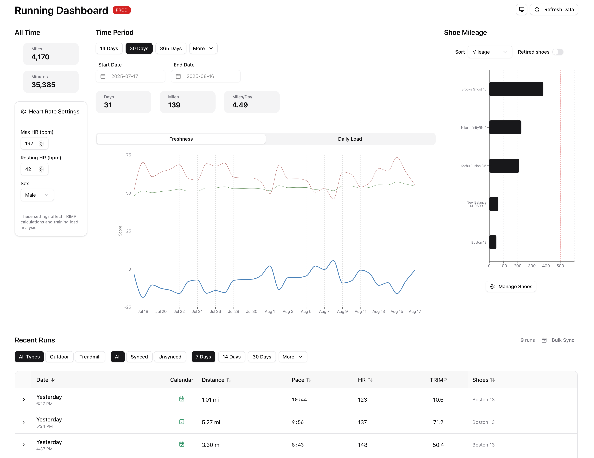

# Running Dashboard

A Python API (in `./api`) and a React front end (in `./dashboard`) that together display my running data from Strava and MapMyRun.



## Testing

See `api/README.md` for full details. Quick start:

```sh
cd api
uv sync --group dev
# Unit tests
make test
# End-to-end API+DB tests (requires Docker)
make e2e-test
# External integration tests (Strava credentials required)
make int-test
```
